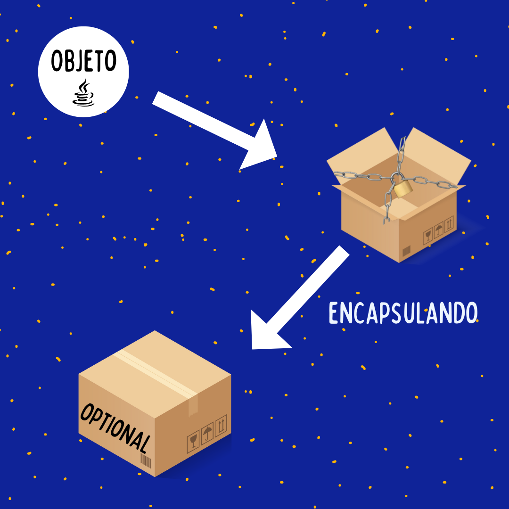

# 📚 Optional

Uma classe implementada no Java 8 que visa simplificar os códigos e facilitar a vida de nós, desenvolvedores

A proposta deste recurso é informar se o valor (Java generics) está presente ou não com um retorno encapsulado.



Fazendo uma analogia, o Optional é como uma caixa onde guardamos um objeto para evitarmos o erro _NullPointerException_

### 💫 Vantagens ?

- Evita os erros do tipo **_NullPointerException_**
- Não necessita de uma condicional `if()` para verificar se o objeto é nulo
- Torna o código mais limpo e elegante

Precisa desse objeto ? Utilize os métodos que Optional fornece:

```java

//Optional com valor vazio
Optional <String> optional = Optional.empty();

//Valor diferente de nulo
Optional <String> optional = Optional.of(nomes[5]);

//Pode ter um valor nulo
Optional<String> optional = Optional.ofNullable(nomes[5]);

```

Acima temos 3 métodos para se criar um Optional

| Métodos                    | Descrição                                                                  |
| -------------------------- | -------------------------------------------------------------------------- |
| **empty()**                | Retorna instância do Optional vazia                                        |
| **of(_elemento_)**         | Temos um Optional com algum valor que não pode ser nulo                    |
| **ofNullable(_elemento_)** | Se tiver algum valor, retorna o Optional com o valor, senão retorna vazio. |

#### 💥 Métodos fornecidos pela Classe Optional

| Métodos           | Descrição                                                                                                                                                                                                                                             |
| ----------------- | ----------------------------------------------------------------------------------------------------------------------------------------------------------------------------------------------------------------------------------------------------- |
| **filter()**      | Com o valor presente e que corresponda ao critério de filtragem é nos retornado um `Optional` com o valor, caso o contrário retorna um `Optional` vazio                                                                                               |
| **isPresent()**   | Checa o valor presente. Se estiver retorna `true`, se não, retorna `false`                                                                                                                                                                            |
| **isEmpty()**     | Checa se o valor **NÃO** está presente. Se não estiver retorna `true`, se não, retorna `false`                                                                                                                                                        |
| **get()**         | Retorna o valor contido no `Optional` se estiver presente. Se não estiver presente, lança uma exceção `NoSuchElementException`. É recomendado usar métodos como `isPresent()` ou `ifPresent()` para verificar a presença antes de chamar este método. |
| **ifPresent()**   | Executa uma ação se o valor estiver presente no `Optional`. A ação é representada por um `Consumer` que é chamado com o valor como argumento, se presente. Caso contrário, nada é feito.                                                              |
| **map()**         | Transforma o valor contido no `Optional`, se presente, aplicando uma função de mapeamento. Retorna um novo `Optional` com o resultado da função aplicada, ou um `Optional` vazio se o valor original estiver vazio.                                   |
| **flatMap()**     | Similar ao `map()`, mas quando a função de mapeamento retorna um `Optional`. Em vez de aninhar os `Optional`, `flatMap()` retorna o `Optional` resultante diretamente.                                                                                |
| **orElse()**      | Retorna o valor contido no `Optional`, se presente. Se não estiver presente, retorna um valor padrão fornecido como argumento.                                                                                                                        |
| **orElseGet()**   | Similar ao `orElse()`, mas em vez de fornecer um valor padrão, aceita um `Supplier` que fornece o valor padrão somente se necessário. Isso pode ser útil quando o valor padrão envolve processamento adicional ou é custoso de calcular.              |
| **orElseThrow()** | Retorna o valor contido no `Optional`, se presente. Se não estiver presente, lança uma exceção fornecida pelo `Supplier`. Isso permite que você lance uma exceção personalizada quando o valor não está presente.                                     |

## ❌ Exemplo sem Optional

```java
    public class ExemploOptional{

        public static void main (String[] args) {
            String[] nomes = new String[10]
            String nome = nomes[5];
            System.out.println(nome);
        }
    }
```

No console será impresso a seguinte mensagem

##### ↘ Resultado no console

```console
Exception in thread "main" java.lang.NullPointerException
```

A posição 5 do vetor é nula, já que não foi preenchido nenhum valor e por isso o **NullPointerException**

## ✅ Implementando Classe Optional

```java

public class ExemploOptional{
    public static void main(String[] args) {
        String[] nomes = new String[10];

        Optional<String> verificaNulo = Optional.ofNullable(nomes[5]);

        if(verificaNulo.isPresent()){
            String nome = nomes[5];
            System.out.println(nome);
        } else 
            System.out.println("A palavra é nula");
    }
}
```

##### ↘ Resultado no console

```console
    A palavra é nula
```
### Utilizandos os métodos
```java

public class ExemploOptional{
    public static void main(String[] args){

		String[] nomes = new String[10];
		nomes[2] = "João Pedo Belo";
		
		//Cria uma instancia de Optional Vazio
		Optional<String> optional = Optional.empty();

		System.out.println("Optional vazio: " + optional);
		System.out.println("Optional está vazio ? " + optional.isEmpty());

		System.out.println("---------------------------------------------");
		
		//Permite um valor nulo
		Optional<String> valorSegundaPosicao = Optional.ofNullable(nomes[2]);
		
		//Verifica se o valor está presente
		System.out.println("Nome existe ?" + valorSegundaPosicao.isPresent());
		
		//Imprimindo o nome
		System.out.println("Nome: " + valorSegundaPosicao.get());

    }
}
```
##### ↘ Resultado no console

```console
Optional vazio: Optional.empty
Optional está vazio ? true
---------------------------------------------
Valor existe ? true
Nome: João Pedo Belo
```
### Mais exemplos
```java

public class ExemploOptional{
    public static void main(String[] args) {
        ArrayList<Pessoa> pessoas = new ArrayList<Pessoa>();

		pessoas.add(new Pessoa("Samuel", "Silvério"));
		pessoas.add(new Pessoa("João", "Pedro"));
		pessoas.add(new Pessoa("James", "Bond"));

		Optional<Pessoa> valor1 = Optional.of(pessoas.get(0));

		valor1.map(resposta -> resposta.getNome()).filter(nome -> nome.startsWith("S"))
				.orElseThrow(() -> new RuntimeException("Não encontrado"));

		System.out.println(valor1.get().getNome());

	
    }
}
```
>No exemplo acima estamos pegando o primeiro elemento da lista pessoas e implementando Optional para esse valor. Através do método `map()`, criamos um laço condicional e com o `filter()` foi o responsável pela condição. Caso seja atendida, é impresso o nome da pessoa na tela, do contrário, será jogada uma `RunTimeException` com a mensagem não encontrado
## 🔗 Links auxiliares

- [Chega de NullPointerException](https://www.alura.com.br/artigos/chega-de-nullpointerexception-trabalhe-com-o-java-util-optional?utm_term=&utm_campaign=%5BSearch%5D+%5BPerformance%5D+-+Dynamic+Search+Ads+-+Artigos+e+Conte%C3%BAdos&utm_source=adwords&utm_medium=ppc&hsa_acc=7964138385&hsa_cam=11384329873&hsa_grp=111087461203&hsa_ad=687448474447&hsa_src=g&hsa_tgt=dsa-2276348409543&hsa_kw=&hsa_mt=&hsa_net=adwords&hsa_ver=3&gad_source=1&gclid=CjwKCAiAibeuBhAAEiwAiXBoJAu1UXMMavXGvTQjiWm_kv6ADtjkEg1Gg3UIpUk269a-5GaD4tDW-xoC95wQAvD_BwE)
- [Para que serve o Optional ?](https://pt.stackoverflow.com/questions/447672/para-que-serve-o-optional-do-java-8-como-usar)
